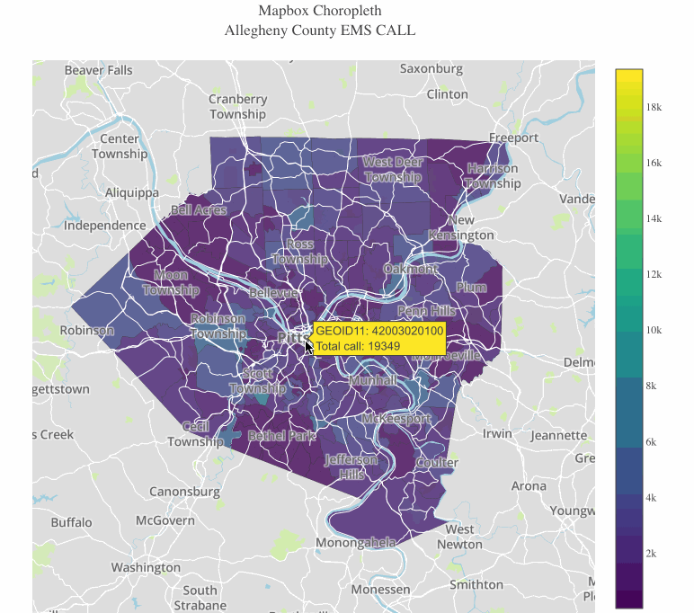

# EMS-Dispatches-Pittsburgh
This repository contains jupyter notebooks which explore [Allegheny County 911 EMS Dispatches data](https://data.wprdc.org/dataset/allegheny-county-911-dispatches-ems-and-fire) using  [Plotly](https://plot.ly/), [seaborn](https://seaborn.pydata.org/) and [Mapbox](https://www.mapbox.com/).

There are four jupyter notebooks:

1. 
 data_preprocessing.ipynb   

2. `data_preprocessing-EMS-population.ipynb`  

3. `data-visualization-seaborn.ipynb`  

4. `data-visualization-plotly.ipynb`  

5. `plotly_map_plot.ipynb`  

All of these notebooks can be opened and run at Google Colaboratory  .

---
## data_preprocessing.ipynb
Clean up the data and fill missing values.

---
## data_preprocessing-EMS-population.ipynb
EMS-dispatches data only contains such as city name and GEOID but does not include the population. Therefore, the population for each sub-counties of Allegheny is extracted from [US Census]('https://www2.census.gov/programs-surveys/popest/datasets/2010-2017/cities/totals/sub-est2017_42.csv').

---
- `data_preprocessing_plotly.ipynb` is a walk-through tutorial on using [Plotly](https://plot.ly/) instead of seaborn or matplotlib.
A tutorial on how to use [Plotly](https://plot.ly/) to plot an interactive choropleth map by layering with [Mapbox](https://www.mapbox.com/).

